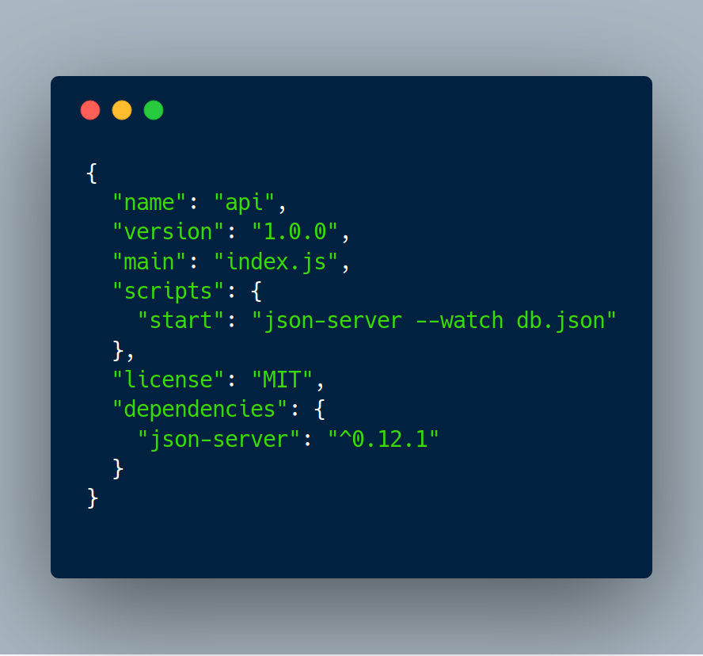
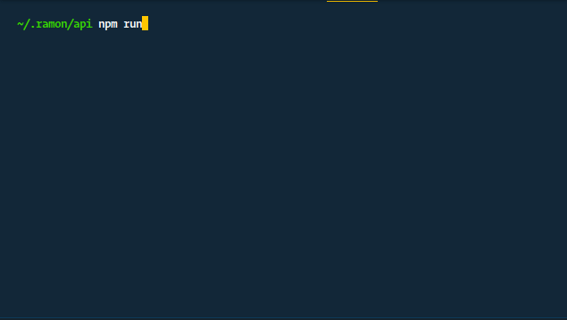

> En menos de 5 minutos y publicado en Internet
> _Actualizado 08/02/2018_

Hola según las estadísticas de médium este es uno de mis posts mas leídos 585 vistas, 438 lecturas un 75% de tasa de lectura y 3 aplausos que <em>difícil es conseguir aplausos en Medium fue publicado en el 2016 (por un error muy tonto la elimine y la volví a crear), </em>por ese motivo lo estoy actualizando.

Anteriormente en este post, intente explicar como utilizar Json Server para utilizarlo temporalmente en el ambiente de desarrollo para un equipo frontend.

### Requisitos previos

- [Instalar Nodejs.](https://github.com/creationix/nvm)
- [Definir la estructura del API de pruebas.]("https://gist.github.com/devrchancay/c56278c2c5146645fc808ba3cf347d99)

### Instalar Json Server

Json server es un paquete de npm que nos permite generar un api restful con los verbos básicos http y los nuestros recursos (endpoints) y todo en base a un archivo db.json donde definimos el esquema del mismo.

Es habitual instalarlo de forma global, pero lo puedes usar de forma local en tu proyecto o usar npx.

Para instalarlo de forma global escribimos en nuestra consola:

```
npm install -g json-server
```

La instalación puede tardar unos minutos, pero como se instala globalmente solo se lo hace una sola vez.

Para este caso vamos a definir un esquema para un blog.

Donde tendremos tres recursos.

- Post
- Comentarios
- Perfiles

Lo guardaremos con el nombre de db.json.

```json
{
  "posts": [
    {
      "id": 1,
      "title": "API REST para pruebas en 5 minutos, publicado en internet",
      "author": "@devrchancay",
      "url": "https://medium.com/p/734d31660d1e/"
    }
  ],
  "comments": [
    {
      "body": "¡Qué buen post! Gracias a esto vendi un proyecto millonario",
      "postId": 1,
      "profileId": 1
    }
  ],
  "profile": {
    "id": 1,
    "name": "Ramón",
    "nickname": "devrchancay"
  }
}
```

Luego de eso en el directorio donde se encuentra el archivo db.json, levantamos nuestro servidor local con el comando:

```
$ json-server --watch db.json
```

Con el esto tenemos el servidor local escuchando en el puerto 3000 puedes visitar

[http://localhost:3000](http://localhost:3000)

Y tendremos los siguientes recursos

- http://localhost:3000/posts
- http://localhost:3000/comments
- http://localhost:3000/profiles

Esto nos permite trabajar en paralelo con el equipo de backend, sin depender de que ellos entreguen un api estable.

### Publicarlo en internet

La portabilidad del proyecto es garantizada si usas git, solo es un archivo _db.json_.

Por alguna razón necesitas tener tu api publicado en Internet, y como es un api de pruebas deberías tener un servidor de pruebas, para eso vamos a utilizar [now](https://zeit.co/now)

Now desde mi punto de vista es uno de los proveedores más sencillos de utilizar gratuitamente, nos permite tener proyectos en Node.js, usar Docker o subir un sitio web de archivos estáticos.

Para comenzar debes instalar now, para Windows y Mac cuentas con una aplicación con interfaz gráfica llamada [now desktop](https://zeit.co/download), para Linux [now cli](https://zeit.co/download#now-cli) también está disponible para Mac y Windows para los que preferimos la consola.

### Comenzando

En los siguiente pasos vamos a emplear now cli para instalarlo debemos escribir

```bash
$ npm install -g now-cli
```

en este momento mínimo debes tener el esquema en un archivo llamado _db.json_ y un package.json si no lo tienes puedes generarlo fácilmente con

```bash
$ npm init --yes
#instalar json-server de forma local
$ npm install json-server --save
```

#### npm scripts

Para que nuestro api funcione debemos definir el script "start" en el archivo _package.json_ quedaría así:



probamos desde la consola con el siguiente comando

```bash
$ npm run start
```



finalmente subimos el api a now con el siguiente comando:


Pueden visitar el api de prueba en [https://api-obigabdkgi.now.sh](https://api-obigabdkgi.now.sh)
