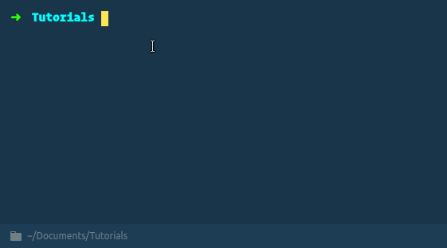

> > **NOTA:** Para las últimas versiones de create-react-app ( a partir de react-scripts@2.0.0) todo lo que necesitas es instalar node-sass y añadir tus archivos .scss o .sass a tus componentes. Este artículo es válido para versiones inferiores a la 2.0.0.

Para todo esto vamos a utilizar un paquete de npm llamado create-react-app, el cual nos genera la estructura básica de nuestra aplicación y las configuraciones para enviar nuestra aplicación a producción fácilmente.

### Iniciando el proyecto

Para comenzar el proyecto escribimos en nuestra terminal `create-react-app react-sass-app`



<figcaption>comenzado el proyecto de React.</figcaption>

esperamos mientras se instalan las dependencias necesarias para que create-react-app funcione correctamente y al finalizar tendremos una estructura similar a esta:

```
+ react-sass-app
 — .gitignore
 — node_modules
 — package.json
 — public
 — README.md
 — src
 — yarn.log
```

### Configurar Sass

A la configuración por defecto le vamos agregar las siguientes dependencias:

#### [node-sass](https://www.npmjs.com/package/node-sass)

Este modulo se encarga de compilar los archivos escritos en sass y llevarlos a código css es mucho mas rápido y sencillo de configurar comparado con la instalación de ruby.

#### [node-sass-chokidar](https://www.npmjs.com/package/node-sass-chokidar)

Es un wrapper de node-sass con una serie de optimizaciones.

#### [npm-run-all](https://www.npmjs.com/package/npm-run-all)

Simplifica el uso de npm scripts, nos permite ejecutar varios scripts de forma paralela.

Para poder utilizarlos debemos instalarlos como dependencias de desarrollo:

```bash
#Utilizando npm
$ npm install node-sass node-sass-chokidar npm-run-all -D
#Utilizando Yarn
$ yarn add node-sass node-sass-chokidar npm-run-all -D
```

Debemos modificar el _package.json_, el cual debería ser similar/igual en los siguientes scripts.

```json
{
  "scripts": {
    "start": "react-scripts start",
    "build": "react-scripts build",
    "test": "react-scripts test — env=jsdom",
    "eject": "react-scripts eject"
  }
}
```

Modificaremos hasta dejarlos de esta forma:

```json
{
  "scripts": {
    "build-css": "node-sass-chokidar --include-path ./src --include-path ./node_modules src/ -o src/",
    "watch-css": "npm run build-css && node-sass-chokidar src/ -o src/ --watch --recursive",
    "start-js": "react-scripts start",
    "start": "npm-run-all -p watch-css start-js",
    "build-js": "react-scripts build",
    "build": "npm-run-all build-css build-js",
    "test": "react-scripts test --env=jsdom",
    "eject": "react-scripts eject"
  }
}
```

### Entendiendo los cambios.

Cuando iniciamos un proyecto con create-react-app para utilizar el servidor de desarrollo tenemos que ejecutar el npm script “start” el cual utiliza el comando react-scripts start propio del paquete create-react-app.

Lo que hicimos es crear un script que escucha los cambios y compila los archivos con extensión .scss (watch-css) y uno que los deja listos para enviar a producción (build-css)


### Como utilizarlo

Cada vez que necesites un archivo nuevo lo vas a crear con la extensión .scss en la carpeta src, el script “watch-css” lo va a compilar y generar un archivo con el mismo nombre y extensión .css es decir si creas un archivo llamado app.scss se va a compilar a app.css en el mismo directorio donde lo creaste y vas a poder incluirlo en tus componentes

```javascript
import 'app.css';
```

### Soporte para compass

[Compass](http://compass-style.org) es una librería que contiene una serie de reglas y mixins, para los que usamos stylus alguna vez es como un nib, para incluirlo en el proyecto debemos instalar compass-mixins:

```bash

$ npm install compass-mixins -D
# ó
$ yarn add compass-mixins -D
```

Para utilizar compass debemos agregarlo al principio de nuestro archivo .scss.

tu archivo debería quedar más o menos así:


> Gracias a Giannella Paredes por recordarme el uso de compass.

Te comparto el [repositorio](https://github.com/devrchancay/react-sass-app) de ejemplo por si tienes alguna duda.
