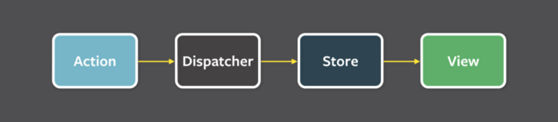
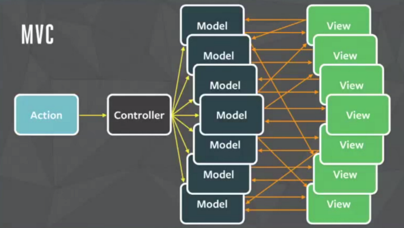
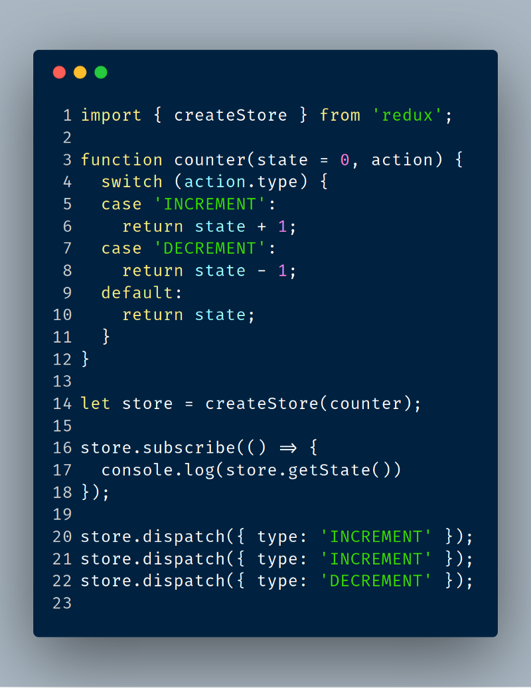

Decidí escribir una serie de artículos, relacionados con la arquitectura flux aplicados con React y Vue, encontré la necesidad de aportar con contenido de valor para desarrolladores que no sabemos muchas veces por donde comenzar para adoptar un nueva tecnología.

Intentare detallar lo conceptos necesarios para comenzar a implementar tus nuevos proyectos Frontend y migrar los actuales.

### Flux

Flux es la arquitectura de aplicaciones que Facebook usa para construir aplicaciones web del lado del cliente. Utilizando un flujo de datos unidireccional.

Los datos de una aplicación con la arquitectura flux, fluyen en una sola dirección.

<figcaption>Un flujo de datos unidireccional es fundamental para el patrón Flux, y el diagrama anterior debe ser el modelo mental principal para el programador.</figcaption>

¿Pero que quiere decir flujo de datos en una sola dirección?

Los datos fluyen en una sola dirección lo cual nos permite tener más control de nuestra aplicación haciendo fácil detectar y corregir errores, lograr llevar tu aplicación a un estado anterior o siguiente sin muchas complicaciones, el concepto fue creado para mejorar los puntos débiles y la dificultad de controlar los cambios en el frontend del patrón MVC.

### Problemas con el MVC

En este patrón legendario se consideran tres roles:

- **Modelo**: Gestiona los datos y el comportamiento en la aplicación.
- **Vista**: Representa la visualización del modelo en la interfaz de usuario.
- **Controlador**: toma la entrada del usuario, manipula el modelo y hace que la vista se actualice

MVC es utilizado desde 1976, ha resistido el paso del tiempo y proyectos muy grandes lo siguen utilizando aun.

> ¿Entonces cual es el problema?

El patrón MVC no se ajustaba a Facebook y uno de sus principales problemas era el flujo de datos bidireccional, donde un cambio en la interfaz dispara múltiples eventos que afectan a múltiples vistas generando efectos en cascada, haciendo muy difícil depurar y resolver un problema.

<figcaption>Modelo, Vista y Controlador en acción</figcaption>

como se puede ver en la imagen anterior un controlador muchas veces es responsable de más de un modelo los cuales generan cambios a más de una vista, de forma visual no se puede entender el flujo de los datos fácilmente, por eso muchas empresas están cambiando el MVC por Flux en el cliente y servidor.

### Decidiendo por donde comenzar.

Existen muchas implementaciones de Flux para distintos frameworks y librerías, yo recomiendo dos de las opciones más populares [Redux](http://es.redux.js.org/) y [Vuex](https://vuex.vuejs.org/en/intro.html), las cuales se pueden utilizar en casi cualquier cosa inclusive Vanilla Javascript ( En caso de que te guste Angular ), pero su desarrollo fue enfocado a [React](https://es.reactjs.org/) y [Vue](https://es-vuejs.github.io/vuejs.org/v2/guide/) respectivamente.

### React y Redux

Si tienes experiencia previa con React, no te molesta el JSX y tienes conocimientos medios de Javascript en general, deberías aprender Redux.

#### Redux se basa en 3 principios:

- **Una sola fuente de verdad**

  El estado de tu aplicación esta almacenado en un árbol único llamado store, eso hace más fácil depurar tu aplicación.

- **El Estado es de solo lectura**

  La única forma de modificar el estado es emitiendo una acción, un objeto describiendo que ocurrió, esto te asegura que ni tu vista ni callbacks de red van a modificar el estado directamente.

- **Los cambios se realizan con funciones puras.**

  Los reducers son funciones puras que toman el estado anterior y una acción, y devuelven un nuevo estado.

<figcaption>
Redux en 22 lineas de código. encuentra el Gist explicado en http://es.redux.js.org/
</figcaption>

### Vue y Vuex

Es un patrón de gestión de estado más biblioteca para aplicaciones Vuejs. Tiene un store centralizado para todos sus componentes, con reglas que garantizan que el estado solo se puede mutar de manera predecible, esta inspirado en Redux, Flux y Elm.

A diferencia de Redux, Vue adicionalmente utiliza:

- **Estados derivados.**

  A veces es posible que tengamos que calcular el estado derivado en función del estado del store, Vuex nos permite definir getters el resultado de esa función se almacena en cache y solo se volverá a re-calcular cuando se realice un cambio a sus dependencias.

- **Módulos**

  Vuex nos permite dividir el store en módulos. Cada módulo puede contener su propio estado, mutaciones, acciones, getters.

Espero que te encuentres interesado(a) en implementar el patrón flux en tus próximos proyectos, seguiré escribiendo sobre temas relacionados y construiremos aplicaciones utilizando Redux y Vuex.

Lecturas recomendadas:

- [Los tres principios de Redux](http://es.redux.js.org/docs/introduccion/tres-principios.html)
- [Reducers y Funciones puras Redux](http://es.redux.js.org/docs/basico/reducers.html)
- [Vuex Getters](https://vuex.vuejs.org/guide/getters.html)
- [Módulos de Vuex](https://vuex.vuejs.org/guide/modules.html)
- [Inmutabilidad en Javascript](https://medium.com/entendiendo-javascript/wip-immutabilidad-en-javascript-todo-a-cambiado-d3d4dc3f997)
