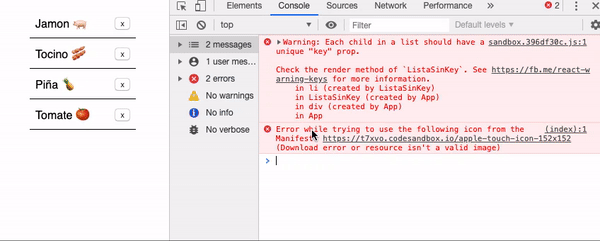
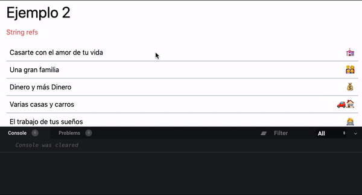

Es muy común caer en anti-patrones, me pasa mucho por no profundizar en la documentación al querer implementar técnologias nuevas. Me paso con JQuery, Angular, Vue, React, Javascript en general y con todo lo que alguna vez trabaje.

### Javascript

Al día de hoy tengo 5 años trabajando activamente con javascript literalmente «desayuno javascript» mayormente en el **Frontend**, tambien hago **Backend** anque no mucho como quisiera.

Vamos a ver los errores más «comunes» que podemos cometer a la hora de usar React, muchos de los cuales he encontrado al momento de mantener código y muchas veces por apuro/descuido los he cometido.

#### 1. Listas y keys.

Renderizar una lista de componentes a base de un objeto o arreglo, es algo que se hace **mucho** en React para eso es necesario especificar un `key` a cada ítem de la lista. Las keys ayudan a identificar que items han cambiado, son agregados, o son eliminados.

Las keys deben especificarse dentro del array para darle a los elementos una identidad estable y es necesario que este elemento sea único.

```jsx
// Dada esta lista de elementos.
const ingredientes = [
  { name: 'Jamon 🐖' },
  { name: 'Tocino 🥓' },
  { name: 'Piña 🍍' },
  { name: 'Tomate 🍅' },
];
```

Podemos notar que esta lista no tiene un elemento único `id`, por lo tanto no vamos a enviar el `ref`.

#### No especificar el key

```jsx
const ListaSinKey = () => (
  <ul>
    {ingredientes.map(ingrediente => (
      <li>{ingrediente.name}</li>
    ))}
  </ul>
);
```

Esto va a producir un warning en el ambiente de desarrollo indicando que falta el `key` en el ítem, a pesar de eso React en su lugar va a usar el índice del arreglo como key y eso nos puede traer problemas de rendimiento.

Dado que el `key` lo utiliza React para identificar los cambios al re-ordenar, eliminar o agregar un elemento el key (indice) cambiara y eso va a producir que todos los elementos afectados se vuelvan a renderizar.



#### Solución

> Especificar siempre el `key` en una lista, si tu colección no tiene un `id` o elemento único, si no lo tienes podrias tener un número 'global' asi garantizas que el id es único.

```javascript
let ingredienteId = 1;

function colocarUnIdEstoNoEsUnParche(ingredientes) {
  return ingredientes.map(function(ingrediente) {
    return {
      id: ingredienteId++,
      ...ingrediente,
    };
  });
}

const ingredientesConId = colocarUnIdEstoNoEsUnParche(ingredientes);

const ListaSinKey = () => (
  <ul>
    {ingredientesConId.map(ingrediente => (
      <li key={ingrediente.id}>{ingrediente.name}</li>
    ))}
  </ul>
);
```

Si incluir una librería no es un problema para ti puedes hacer lo mismo con `shortid` o `react-key-index` aunque seria incrementar innecesariamente el peso del bundle, tambien puedes hablar con los backends para que se aseguren de enviarte un id único en una lista de elementos.

#### Si te interesa saber más

- <a target="_blank" href="https://medium.com/@robinpokorny/index-as-a-key-is-an-anti-pattern-e0349aece318">Index as a key is an anti-pattern</a>
- <a target="_blank" href="https://menubar.io/react-keys-index">Don't Use Index For Keys in React</a>
- <a targer="_blank" href="https://medium.com/@vraa/why-using-an-index-as-key-in-react-is-probably-a-bad-idea-7543de68b17c">Why using an index as Key in React is probably a bad idea?</a>

<hr/>

#### 2. Manipular DOM

React en su sitio oficial lo describe como "Una biblioteca de JavaScript para construir interfaces de usuario" una de las primeras necesidades al usar la librería es manipular el DOM, agregar/quitar una clase, eliminar/ocultar un elemento entonces es muy probable pensar en acceder al DOM utilizando:

- `getElementById`
- `querySelector`
- `querySelectorAll`
- `$('#id)`
- `$('.className')`

pero aqui podemos encontrar un problema que por desconocimiento estamos accediendo directamente al DOM y no estamos aprovechando una de las caracteristicas más importantes de React el [Virtual DOM](https://es.reactjs.org/docs/faq-internals.html#what-is-the-virtual-dom)

> ¿Qué problemas podemos tener?

Si trabajas en equipos es muy probable que el componente cambie y muy probable que tus selectores no funcionen como lo esperas.

```html{19}
<!-- 
  Imagina que te van a conceder 
  un deseo, pero te debes elegir
  usando un selector
-->

<!--
  Entonces tu dices:
   -- La Número 3
-->
<script type="text/javascript">
  const deseo = document.querySelector('ul.li:nth-child(3n)');
  console.log(deseo);
</script>

<ul>
  <li>Casarte con el amor de tu vida 💒</li>
  <li>Una gran familia 👨‍👩‍👧‍👦</li>
  <li>Dinero en exceso</li>
  <li>Varias casas y carros 🚗🏠</li>
  <li>El trabajo de tus sueños 👩‍💻</li>
  <li>Vivir de PHP 4.*</li>
</ul>
```

<br/>

```html{12}
<!--
  Antes de que te des cuenta 
  tu compañero diseñador
  tuvo la idea de que la 
  lista se veria mejor de 
  esta forma.
-->

<ul>
  <li>Casarte con el amor de tu vida 💒</li>
  <li>Una gran familia 👨‍👩‍👧‍👦</li>
  <li>Vivir de PHP 4.*</li>
  <li>Dinero en exceso 💰</li>
  <li>Varias casas y carros 🚗🏠</li>
  <li>El trabajo de tus sueños 👩‍💻</li>
</ul>

<!-- 
  Muchas veces los diseñadores
  hacen nuestras vidas 
  miserables
 -->
```

> Una versión del infierno para mi es tener que vivir de PHP 4.\* . _Realmente con cualquier versión me tortura terriblemente._

Ese es un ejemplo, más el verdadero problema es que estamos accediendo al **DOM** directamente y no estamos aprovechando el uso de React dejando que el se encargue de seleccionar los elementos via `Refs`.

```jsx
/**
 * Legacy API String Refs
 * Esto ya no se debe usar.
 **/
class ElegirDeseo extends React.Component {
  elegirDeseoPerfecto() {
    const deseo = this.refs.solucionPerfecta;
    deseo.classList.add('bg-purple-700', 'text-white');
    console.log(deseo);
  }
  render() {
    return (
      <>
        <ul>
          <li>Casarte con el amor de tu vida 💒</li>
          <li>Una gran familia 👨‍👩‍👧‍👦</li>
          <li ref="solucionPerfecta">Dinero y más Dinero 💰</li>
          <li>Varias casas y carros 🚗🏠</li>
          <li>El trabajo de tus sueños 👩‍💻</li>
          <li>Vivir de PHP 4.*</li>
        </ul>
        <button onClick={this.elegirDeseoPerfecto.bind(this)}>
          Elegir deseo
        </button>
      </>
    );
  }
}
```

<br />

```jsx
/**
 *  Para versiones de React 16.2 o inferiores
 *  Se debe usar el patrón callback
 **/

class ElegirDeseo extends React.Component {
  constructor(props) {
    super(props);
    this.deseoPerfecto = null;
    this.setDeseoPerfecto = element => {
      this.deseoPerfecto = element;
    };
    this.setDeseoPerfecto = this.setDeseoPerfecto.bind(this);
  }

  elegirDeseoPerfecto() {
    const deseo = this.setDeseoPerfecto;
    deseo.classList.add('bg-purple-700', 'text-white');
    console.log(deseo);
  }

  render() {
    return (
      <>
        <ul>
          <li>Casarte con el amor de tu vida 💒</li>
          <li>Una gran familia 👨‍👩‍👧‍👦</li>
          <li ref={this.setDeseoPerfecto}>Dinero y más Dinero 💰</li>
          <li>Varias casas y carros 🚗🏠</li>
          <li>El trabajo de tus sueños 👩‍💻</li>
          <li>Vivir de PHP 4.*</li>
        </ul>
        <button onClick={this.elegirDeseoPerfecto.bind(this)}>
          Elegir deseo
        </button>
      </>
    );
  }
}
```

<br />

```jsx
/**
 *  Para versiones de React 16.3 o superiores
 *  Podemos usar React.createRef()
 **/

class ElegirDeseo extends React.Component {
  constructor(props) {
    super(props);
    this.deseoPerfecto = React.createRef();
  }

  elegirDeseoPerfecto() {
    const deseo = this.setDeseoPerfecto.current;
    deseo.classList.add('bg-purple-700', 'text-white');
    console.log(deseo);
  }

  render() {
    return (
      <>
        <ul>
          <li>Casarte con el amor de tu vida 💒</li>
          <li>Una gran familia 👨‍👩‍👧‍👦</li>
          <li ref={this.deseoPerfecto}>Dinero y más Dinero 💰</li>
          <li>Varias casas y carros 🚗🏠</li>
          <li>El trabajo de tus sueños 👩‍💻</li>
          <li>Vivir de PHP 4.*</li>
        </ul>
        <button onClick={this.elegirDeseoPerfecto.bind(this)}>
          Elegir deseo
        </button>
      </>
    );
  }
}
```

<br />

#### Solución

> Siempre que necesites acceder a un elemento especifico del **DOM** usa Refs, tambien podrias usar `findDOMNode()` aunque ya no se recomienda, debido a que rompe la abstracción del componente y está siendo deprecado en el modo estricto **StricMode**.



> Nota: `React.createRef()` no te va a funcionar en un componente de función a menos que hagas referencia a un componente de clase o a un elemento html como `input`, `button`, `textarea` etc.

A criterio personal los `refs`, la inmutabilidad y el ciclo de vida de un componente son las cosas más complejas de entender y aplicar en React.

#### Si te interesa saber más

- <a href="https://es.reactjs.org/docs/refs-and-the-dom.html" target="_blank">Referencias y el DOM</a>
- <a href="https://stackoverflow.com/questions/38093760/how-to-access-a-dom-element-in-react-what-is-the-equilvalent-of-document-getele" target="_blank">How to access a DOM element in React?</a>
- <a href="https://alligator.io/react/refs/" target="_blank">Introduction to the React Ref System</a>
- <a href="https://es.reactjs.org/docs/react-dom.html#finddomnode" target="_blank">findDOMNode() </a>

#### 4. Mutar propiedades

React te permite crear componentes reutilizables e independientes, es ideal pensar en cada pieza de forma aislada para que se pueden reutilizar.
Conceptualmente, los componentes son funciones _puras_ de Javascript que aceptan entradas (`props`) y devuelven elementos de React.

#### Función pura.

Vamos a recordar que es una función pura con el siguiente ejemplo:

```javascript
function cuantoCobrarPorHacerSoftware(loQueTuCreesQueCuesta) {
  return loQueTuCreesQueCuesta * 10;
}

cuantoCobrarPorHacerSoftware(200); // 2000
cuantoCobrarPorHacerSoftware(100); // 1000
/**
 * Recuerda: Cobrar bien por hacer software
 * */
```

Las funciones llamadas `puras` son las que **no** cambian sus entradas en este caso `loQueTuCreesQueCuesta` y devuelven el mismo resultado para las mismas entradas no importa las veces que la invoques, lo que facilita mucho escribir pruebas.

#### Función impura.

Al contrario de una función pura, este tipo de funciones hacen operaciones que afectan a variables fuera de la misma, modifica las entradas, hace operaciones que producen efectos secundarios de tal forma de que el resultado sea impredecible en cada invocación a pesar de enviar la misma entrada.

```javascript
const diasRestantes = 15;

/**
 * Esta función depende de una variable que
 * esta fuera de ella.
 * hace operaciones aleatorias
 * con las entradas.
 **/
function clientePreguntaFechaDeEntrega(diasAdicionales) {
  const fechaFinal =
    diasRestantes + diasAdicionales * Math.round(Math.random() * 100);
  return `${fechaFinal} días`;
}
clientePreguntaFechaDeEntrega(10); // 143 días
clientePreguntaFechaDeEntrega(10); // 200 días

/**
 *  En la vida real asi no se le estima
 *  tiempo de entrega al cliente. (Bueno no siempre)
 * */
```

React es lo suficientemente flexible pero tiene **UNA SOLA REGLA ESTRICTA**:

**~~No debes usar PHP~~.
Todos los componentes de React DEBEN actuar como funciones puras con respecto a sus props.**

Dicho esto todos los componentes deben ser predecibles sus resultados con relación a sus props, es decir no importa las veces que invoques el componente si envias las mismas props siempre tendras la misma salida.

```jsx
class ComponenteSorprendeteDeReact extends React.Component {
  render() {
    return this.props.esFinDeMes ? (
      <p>
        Vete de viaje, sal con tu familia, gasta el dinero como que no existe un
        mañana
        <span aria-label="money-mouth-face" role="img">
          🤑
        </span>
      </p>
    ) : (
      <p>
        Espera el fin de mes pobre como una rata
        <span aria-label="rat" role="img">
          🐀
        </span>
      </p>
    );
  }
}

/**
 * Facilmente puedes saber cual va a ser la salida
 * según la prop (esFinDeMes) que le pases
*/

<ComponenteSorprendeteDeReact esFinDeMes={true} /> //  🤑
<ComponenteSorprendeteDeReact esFinDeMes={false} /> // 🐀
```

React es muy claro en la documentación sobre este punto, pero quien no ha tenido requerimientos de último minuto, el cliente esta esperando en la oficina de al lado, el día siguiente es feriado o vamos a comenzar las vacaciones etc.

y terminamos escribiendo algo así:

```jsx{8,17,21}
/**
 * A esta persona le pagan 3 días antes del 30
 **/
class ComponenteALaSuerteDeReact extends React.Component {
  constructor(props) {
    super(props);
    this.state = {
      esFinDeMes: this.props.esFinDeMes, // Hacer esto te convierte en un moustruo
    };
  }

  componentDidMount() {
    const queDiaEsHoy = parseInt(new Date().getDate(), 10);
    const diferenciaConFinDeMes = 30 - queDiaEsHoy;
    const pocosDiasParaFinDeMes = diferenciaConFinDeMes <= 3;
    // Lo que debería hacer una prop se lo dejan a un estado.
    this.setState({ esFinDeMes: pocosDiasParaFinDeMes });
  }

  render() {
    return this.state.esFinDeMes ? ( // lo mismo del punto anterior.
      <p>
        Vete de viaje, sal con tu familia, gasta el dinero como que no existe un
        mañana
        <span aria-label="money-mouth-face" role="img">
          🤑
        </span>
      </p>
    ) : (
      <p>
        Espera el fin de mes pobre como una rata
        <span aria-label="rat" role="img">
          🐀
        </span>
      </p>
    );
  }
}
```

El ejemplo anterior está mal en muchos sentidos:

- **1)** Pasar el valor de las propiedades (`props`) a estados en el constructor de hecho es recomendable no hacerlo en ningún lado las props son de solo lectura y en una función pura vendrían a ser las «entradas». <br/>
  El uso de propiedades para "inicializar" el estado conduce a duplicación de "la fuente de verdad" esto hace difícil determinar donde se encuentran los datos reales y esto puede ocacionar errores si el componente se "actualiza" el nuevo valor nunca se mostrara ya que el _constructor se ejecuta solo cuando el compomente se crea por primera vez._
- **2)** Hacer una operación impredecible con el valor de la propiedad.
- **3)** Hacer que el componente reaccione en base al estado derivado de una propiedad.

Para resolver problemas así debemos tener en cuenta los **container** y **presentational** components

#### Container Components

Podemos deducir por su nombre que son contenedores, la mayoria de estos componentes no tienen presentacion grafica **UI** son los encargados de hacer peticiones HTTP, hacer cálculos y pasar las propiedades a los componentes presentacionales. _Sí, aqui deberíamos hacer el cálculo de los 3 días_

#### Presentational Components

Componentes que solo se encargan de presentar UI son funciones puras que reaccionan según las `props` que les envie, un ejemplo de ello sería `<ComponenteSorprendeteDeReact />`

> **Nota:** Este concepto era muy famoso hace unos años, ahora mismo no es necesario hacer una separación estricta de componentes de esta forma, ahora existen los `hooks` que permiten hacer lo mismo. Debes tenerlo en cuenta si en algún momento tienes que mantener una base de código que lleva muchos años en desarrollo.

#### Solución

> No debes cambiar el valor de una propiedad y trabajar en tus componentes con el concepto de funciones puras en mente.

#### Si te interesa saber más

- <a href="https://es.reactjs.org/docs/components-and-props.html" target="_blank">Componentes y propiedades</a>
- <a href="https://medium.com/@justintulk/react-anti-patterns-props-in-initial-state-28687846cc2e">React Anti-Patterns: Props in Initial State</a>
- <a href="https://www.robinwieruch.de/react-pass-props-to-component/" target="_blank">How to pass props to components in React</a>
- <a href="https://medium.com/@dan_abramov/smart-and-dumb-components-7ca2f9a7c7d0" target="_blank">Presentational and Container Components</a>

#### 5 Usar `bind()` en el metodo _render_

`bind`, `call` y `apply` son metodos que usamos muchas veces sin saber que hacen exactamente y si llevas poco o mucho tiempo en React seguramente haz visto algo como esto

```jsx
class BindMaligno extends React.Component {
  onSubmit() {
    // Aqui hace algo
  }
  render() {
    return (
      <form onSubmit={this.onSubmit.bind(this)}>
        {/* un formulario con clases de bootstrap 😬 */}
      </form>
    );
  }
}
```

Porque es necesario el `bind()` cuando declaras funciones utilizando clases y la palabra reservada `extends` las funciones personalizadas como `onSubmit()` pierden sus enlaces es decir no puedes acceder a `this.state` , `this.setState`, `this.props` por esa razón las funciones personalizadas deben volver a ser enlazadas con `bind()`.

> ¿Pero donde esta el error en el ejemplo anterior?

Es usarlo dentro del render, dado que `.bind()` crea una nueva función cada vez que se ejecuta, esto llevaría a que se cree una función en cada vez que se ejecuta el metodo render. Esto tiene varias implicaciones de rendimiento en una aplicación pequeña es imperceptible a medida que vaya creciendo la aplicación ya es otra la historia.

#### Solución

La mejor manera de evitar este problema de rendimiento es vincular las funciones en el contructor, de esta manera se creara solo una funcion adicional al momento de la creación del componente y quedara disponible las veces que el render se ejecute.

```jsx{4,11}
class BindMenosMaligno extends React.Component {
  constructor(props) {
    super(props);
    this.onSubmit = this.onSubmit.bind(this);
  }
  onSubmit() {
    // Aqui hace algo
  }
  render() {
    return (
      <form onSubmit={this.onSubmit}>
        {/* un formulario con clases de bootstrap 😬 */}
      </form>
    );
  }
}
```

> Nota vas a poder evitarte el uso de `bind()` si usas componentes definidos como funciones.

También puedes definir tus métodos personalizados usando arrow functions:

```jsx
class LookMomWithowBind extends React.Component {
  onSubmit = () => {};
  render() {
    return (
      <form onSubmit={this.onSubmit}>
        {/* un formulario con clases de bootstrap 😬 */}
      </form>
    );
  }
}
```

<br/>

#### Si te interesa saber más

- <a href="https://medium.com/@esamatti/react-js-pure-render-performance-anti-pattern-fb88c101332f" target="_blank">React.js pure render performance anti-pattern</a>

- <a href="https://es.reactjs.org/docs/handling-events.html" target="_blank">Manejando Eventos </a>

- <a href="https://medium.com/quick-code/react-quick-tip-use-class-properties-and-arrow-functions-to-avoid-binding-this-to-methods-29628aca2e25" target="_blank">Use Class Properties and Arrow Functions to Avoid Binding **this** to Methods</a>

Y todavía no hablamos del manejo de estilos, de las pruebas unitarias, de los metodos del ciclo de vida entre otros temas que quizas los deje para la segunda parte de este post.
